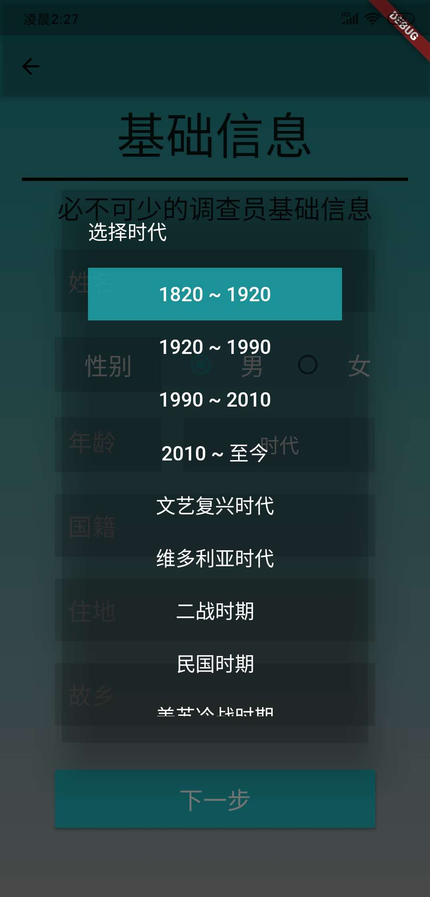

# COC TRPG

## 介绍

 一个基于Flutter实现的COC跑团工具，目前还不完整

## 预览

    
    
    

    
    
    

   

    
    

## TODO

### 第一版本（离线版）

Bug 修复

头像上传保存

equipment的页面删除交互改为添加icon

方形改为圆角

技能选择支持自定义

子技能选择实现

默认选择该职业的职业技能

增加多样的骰子

判定的结果加入延迟效果

年龄判定以减少相关的属性

加入百科功能

加入调查员档案功能

加入我的和设置

### 第二版本（数据持久化）

### 第三版本（IM系统）